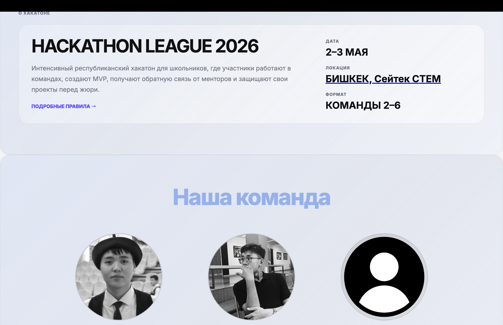

# Hackathon Registration

A modern and responsive landing page for the “Hackathon League 2026” school hackathon event.  
The website presents information about the event, team members, mentors, sponsors, speakers, FAQ, and registration links.

---

## Project Description

This project is a fully responsive event website created for a republican hackathon for школьники (high school students).  
The goal was to build a clean, modern, and visually engaging website that provides all necessary information about the hackathon in one place. Over 200+ hundred users validated.

---

## Features

- Responsive modern UI
- Smooth section-based navigation
- Hero section with CTA button
- Auto-scrolling image carousel
- Team showcase cards
- Sponsors, mentors, and speakers sections
- FAQ accordion section
- Telegram & Instagram integration
- External location and handbook links

---

## Technologies Used

- HTML5
- CSS3
- Google Fonts
- Responsive Design
- Flexbox & Grid Layouts

---

## GitHub Repository

```bash
https://github.com/HackathonLeague/Hackathon_registration
```

## Vercel Deployment Link
```bash
https://hackathon-registration-rho.vercel.app/
```




Challenges
Creating a responsive layout for multiple sections
Organizing large amounts of content
Designing a clean modern UI

What I Learned
Improved HTML & CSS structure skills
Better responsive design practices
Learned how to deploy projects on Vercel
Learned GitHub project management

Future Improvements
Add its own registration page to get rid of auxilary tools like google forms

Author [Baimyrzaev Aruubek]
Contact me : baymyrzaevaruubek10@gmail.com
